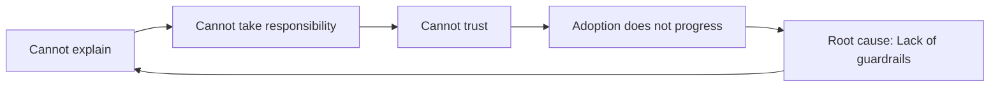
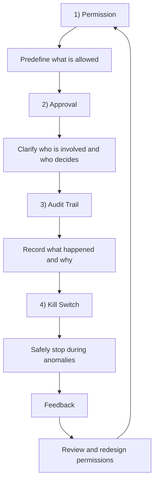
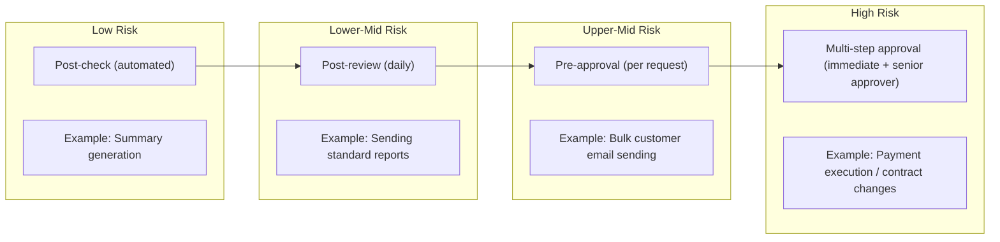
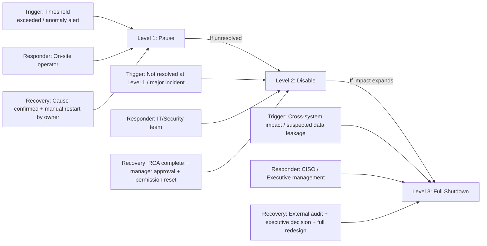
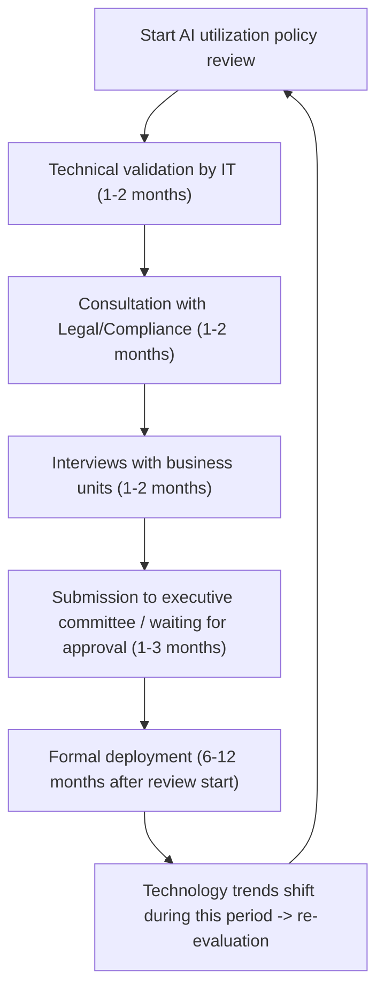
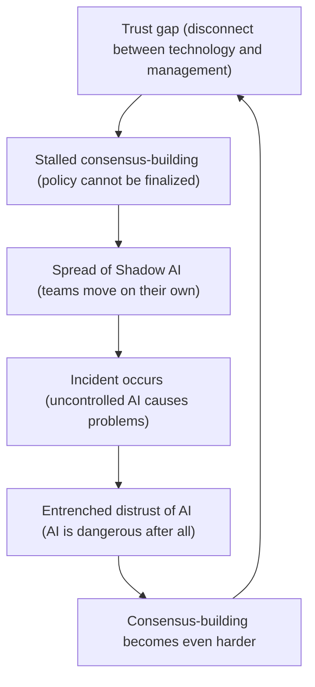

# Guardrail Design in the AI Agent Era: A Practical Framework for Permissions, Approvals, Audit Trails, and Shutdown Procedures

📖 Estimated reading time: ~15 minutes

---

## Key Takeaway (1-Minute Read)

As AI shifts from “AI that talks” to “AI that acts,” the top enterprise priority is **guardrail design**.

Guardrail design is a structured control framework built on **four elements**:

<Table center width="100%" marginTopSize="xs">
    <Table.Thead>
        <Table.Tr>
            <Table.Th cellBackgroundColor="gray">Element</Table.Th>
            <Table.Th cellBackgroundColor="gray">In One Line</Table.Th>
            <Table.Th cellBackgroundColor="gray">Management Meaning</Table.Th>
        </Table.Tr>
    </Table.Thead>
    <Table.Tbody>
        <Table.Tr>
            <Table.Td>**1) Permission**</Table.Td>
            <Table.Td>Who can allow AI to do what, and to what extent</Table.Td>
            <Table.Td>Limit blast radius through least privilege</Table.Td>
        </Table.Tr>
        <Table.Tr>
            <Table.Td>**2) Approval**</Table.Td>
            <Table.Td>Where human intervention must remain in decisions</Table.Td>
            <Table.Td>Eliminate accountability gaps with RACI</Table.Td>
        </Table.Tr>
        <Table.Tr>
            <Table.Td>**3) Audit Trail**</Table.Td>
            <Table.Td>Trace of what AI did and why it did it</Table.Td>
            <Table.Td>Lifeline for accountability and incident response</Table.Td>
        </Table.Tr>
        <Table.Tr>
            <Table.Td>**4) Kill Switch**</Table.Td>
            <Table.Td>Safe procedures to stop AI during anomalies</Table.Td>
            <Table.Td>Protect business continuity through fail-safe design</Table.Td>
        </Table.Tr>
    </Table.Tbody>
</Table>

As of February 2026, **81% of AI agents are already beyond planning and in operation**, yet only **14.4% have full security approval** (source: [Gravitee, State of AI Agent Security 2026](https://www.gravitee.io/blog/state-of-ai-agent-security-2026-report-when-adoption-outpaces-control)). With 88% of organizations reporting AI-agent security incidents, most companies have effectively started running without guardrails.

This white paper explains the framework from both perspectives:
- **Why it is necessary (CxO perspective)**
- **How to implement it (operational perspective)**

> **What you will gain from Part 1:**
> - Structural understanding of AI-agent risk
> - Design principles and interaction of the four guardrail elements
> - Three common organizational failure patterns and how to avoid them
>
> **What you will gain from [Part 2](/features/documentation/white-paper/29/ai-agent-guardrails-governance-2026-implementation):**
> - Three case studies (PC-operation agents / development AI vulnerabilities / autonomous critical infrastructure operations)
> - A practical checklist you can use immediately
> - A 90-day implementation roadmap (PoC -> limited rollout -> expansion)

---

# Chapter 1. Why “AI That Executes” Is Risky Now

## Structural Understanding of AI-Agent Risk

### The Type of Risk Has Changed

AI adoption is no longer experimental. A Nikkei BP survey (July 2025) reports that generative AI tool adoption in Japanese enterprises reached 64.4%, and AI agent adoption reached 29.7% (source: [Nikkei XTECH, 2025](https://xtech.nikkei.com/atcl/nxt/column/18/03314/090800004/)).

However, management must not miss one point: **the risk profile of traditional generative AI and execution-capable AI agents is fundamentally different.**

<Table center width="100%" marginTopSize="xs">
    <Table.Thead>
        <Table.Tr>
            <Table.Th cellBackgroundColor="gray"></Table.Th>
            <Table.Th cellBackgroundColor="gray">Traditional GenAI (Conversational)</Table.Th>
            <Table.Th cellBackgroundColor="gray">AI Agents (Execution-Oriented)</Table.Th>
        </Table.Tr>
    </Table.Thead>
    <Table.Tbody>
        <Table.Tr>
            <Table.Td>**Role**</Table.Td>
            <Table.Td>Suggests ideas and drafts</Table.Td>
            <Table.Td>Executes tasks on behalf of humans</Table.Td>
        </Table.Tr>
        <Table.Tr>
            <Table.Td>**Operator**</Table.Td>
            <Table.Td>Human clicks final action</Table.Td>
            <Table.Td>AI directly operates systems</Table.Td>
        </Table.Tr>
        <Table.Tr>
            <Table.Td>**Risk Type**</Table.Td>
            <Table.Td>Misinformation, copyright issues</Table.Td>
            <Table.Td>Privilege escalation, data leaks, cascading mis-operations</Table.Td>
        </Table.Tr>
        <Table.Tr>
            <Table.Td>**Impact Speed**</Table.Td>
            <Table.Td>There is human review time</Table.Td>
            <Table.Td>Decisions and execution complete in milliseconds</Table.Td>
        </Table.Tr>
        <Table.Tr>
            <Table.Td>**Accountability**</Table.Td>
            <Table.Td>Usually attributable to individual users</Table.Td>
            <Table.Td>Distributed across requester/approver/AI/vendor</Table.Td>
        </Table.Tr>
        <Table.Tr>
            <Table.Td>**Control Difficulty**</Table.Td>
            <Table.Td>Output filtering is often enough</Table.Td>
            <Table.Td>Requires layered controls across input/process/output/permissions</Table.Td>
        </Table.Tr>
    </Table.Tbody>
</Table>

A Deloitte AI Institute survey of 3,235 global leaders (Fall 2025) found that only about 1 in 5 companies has mature governance for AI agents (source: [Deloitte, State of AI in the Enterprise 2026](https://www.deloitte.com/us/en/what-we-do/capabilities/applied-artificial-intelligence/content/state-of-ai-in-the-enterprise.html)). Technology is advancing faster than control.

### Accept the Reality: “Not Fully Controllable”

In February 2026, Anthropic CEO Dario Amodei publicly rejected unrestricted model access requested by the U.S. Department of Defense (source: [TechCrunch, 2026](https://techcrunch.com/2026/02/26/anthropic-ceo-stands-firm-as-pentagon-deadline-looms/)). This exposed a core control issue.

When enterprises integrate external AI models, internal algorithms and training data remain black boxes. Even vendors may not be able to guarantee full transparency to third parties.

The right question is not “Can we fully control AI?” but **“How do we design around what we cannot control?”**

NIST AI Risk Management Framework defines four functions:
- **Govern**
- **Map**
- **Measure**
- **Manage**

Its implication is clear: **design governance on the assumption that AI can behave unpredictably.**

### The Three Walls of the “Trust Gap”

The root problem is a **trust gap**.

Trustworthiness in AI can be decomposed into three elements:

1. **Explainability**: Can we trace how AI reached a decision?
2. **Accountability**: Can we consistently track human decision pathways around AI?
3. **Reliability**: Can we ensure AI-supported decisions do not produce unacceptable harm?

These gaps are not isolated; they form a chain that blocks adoption.

Gartner’s AI in Organizations 2025 Survey shows roughly 53% of enterprises cite unclear reliability/accountability ownership as a top obstacle. The bottleneck is not model capability, but **absence of ownership design**.

### Shadow AI: The Invisible Threat

When trust gaps persist, **Shadow AI** emerges.

If management and IT cannot provide timely policy and approved options, teams adopt tools on their own. Gravitee reports only 47.1% of agents are actively monitored/protected on average; more than half run without meaningful security oversight.

More critically, only 14.4% of production agents had full security approval. The rest operate outside governance boundaries.

Gartner predicts that by end of 2027, over 40% of agentic AI projects will be canceled due to rising costs, unclear value, and weak risk control (cited via: [Forbes, 2025](https://www.forbes.com/sites/markminevich/2025/12/31/agentic-ai-takes-over-11-shocking-2026-predictions/)).

### Structural Challenges Specific to Japanese Enterprises

- **Ringi culture vs AI speed**: multi-stage consensus is slower than millisecond AI execution.
- **Bottom-up operations as double-edged sword**: departmental autonomy can spread unmanaged AI risk.
- **Policy progress vs operational reality gap**: regulations and guidelines advance, but field-level prompt/supplier risk remains hard to cover.

## Chapter 1 Summary

1. **Recognize qualitative risk shift**: from information errors to privilege and cascading-operation risk.
2. **Abandon the full-control illusion**: black-box external models are unavoidable.
3. **Close trust gaps through design—not documents**: explainability, accountability, and reliability must be designed in.

---

# Chapter 2. The Four-Element Guardrail Framework

This chapter breaks guardrail design into four components and explains their meaning, interdependencies, and design guidance.

## Overview: How the Four Elements Work Together

Guardrails are not one-off controls; they are a **cyclical control system**.

The four form a control hierarchy: **prevention -> human intervention -> recording -> emergency response**, and feed back from shutdown results to permission redesign.

<Table center width="100%" marginTopSize="xs">
    <Table.Thead>
        <Table.Tr>
            <Table.Th cellBackgroundColor="gray">Missing Element</Table.Th>
            <Table.Th cellBackgroundColor="gray">Resulting Risk</Table.Th>
        </Table.Tr>
    </Table.Thead>
    <Table.Tbody>
        <Table.Tr><Table.Td>Permission undefined</Table.Td><Table.Td>AI reaches data/systems it should never touch</Table.Td></Table.Tr>
        <Table.Tr><Table.Td>Approval not designed</Table.Td><Table.Td>Cannot trace who authorized action</Table.Td></Table.Tr>
        <Table.Tr><Table.Td>No audit trail</Table.Td><Table.Td>Root-cause analysis and prevention become impossible</Table.Td></Table.Tr>
        <Table.Tr><Table.Td>No shutdown procedure</Table.Td><Table.Td>Damage continues even after anomaly detection</Table.Td></Table.Tr>
    </Table.Tbody>
</Table>

## Element 1: Permission

### CxO View

Control starts with clear boundaries of what is allowed vs prohibited. AI agents require stricter control than humans because they run continuously, operate across systems, execute at high speed, and do not self-stop when interpreting instructions incorrectly.

Gravitee reports 45.6% of agents still authenticate with shared API keys, while only 21.9% are managed as independent identities (source: [Gravitee, 2026](https://www.gravitee.io/blog/state-of-ai-agent-security-2026-report-when-adoption-outpaces-control)).

### Operational View: Three Axes

1. **Scope**: data scope, system scope, action scope
2. **Duration**: task-bound, time-bound, event-bound
3. **Ceiling**: value, volume, and blast-radius limits

This enables concrete definitions like: “Sales agent can read only sales customer data, valid until month-end, max 50 operations/day.”

## Element 2: Approval

### CxO View

The most common ambiguity is responsibility: who approved what. The solution is not post-incident blame assignment, but pre-defined responsibility architecture.

### Operational View: Extend RACI for AI Agents

- AI can hold **R (Responsible)** but never **A (Accountable)**.
- **Zero blank A cells** across all processes.
- Approval granularity must match risk levels.

## Element 3: Audit Trail

### CxO View

Audit trail is not just insurance. It is a management asset for:
1. Incident response
2. Compliance evidence
3. Continuous operations improvement

### Operational View

Separate two logs:
- **Action Log**: what happened (5W1H + anti-tamper hash chain)
- **Explainable Action Log**: why AI chose this action (policies, alternatives, rationale)

Without the second, post-incident accountability is incomplete.

## Element 4: Kill Switch

### CxO View

Automation without fail-safe is equivalent to runaway risk.

### Operational View: Three-Level Escalation

Design principles:
- Define recovery conditions when defining stop conditions
- Always keep manual override
- Preserve logs first during shutdown

## Integrated Self-Assessment

Use the following maturity model:

- **Level 0**: not started
- **Level 1**: partially implemented
- **Level 2**: systematized

Most enterprises are currently between Level 0 and 1. What matters is a clear path to Level 2.

## Chapter 2 Summary

When these four elements are in place, AI shifts from “uncontrollable threat” to **“stoppable, traceable, correctable system.”**

---

# Chapter 3. Three Organizational Failure Patterns

## 1) Trust Gap

The technical team and management often define “trust” differently. Engineering emphasizes precision and response speed; management emphasizes explainability, auditability, and legal defensibility.

**Mitigation**: build a translation layer
- Risk dashboard mapping technical metrics to business impact
- Phased approval gates
- Regular bridge meetings across tech/legal/management

## 2) Consensus Cost

Trying to secure full-company agreement from day one causes paralysis.

**Mitigation**: phase consensus scope
- Phase 0: design policy
- Phase 1: single low-risk unit PoC
- Phase 2: 2–3 units with medium-risk operations
- Phase 3: enterprise policy rollout

## 3) Shadow AI

When official paths are slow or unusable, teams adopt unapproved tools.

**Mitigation**: “safe alternatives before restrictions”
1. Visualize real usage
2. Provide safe, usable official alternatives
3. Support migration, then tighten unapproved access

### Breaking the Chain

The three failures are linked.

The highest-ROI intervention is a fast, controlled Phase 1 PoC with all four guardrail elements included.

## Chapter 3 Summary

- Trust gap -> build translation layer
- Consensus cost -> phased expansion with evidence
- Shadow AI -> provide safe alternatives first

---

# End of Part 1: Your Next Move

Part 1 established:
- Why execution-capable AI is riskier now
- The four-element guardrail framework
- Three organizational stumbling patterns

Design alone does not change organizations. Implementation does.

In **Part 2 (Practice & Implementation)**, you get:
- 3 case studies
- A practical checklist
- A 90-day roadmap
- A glossary for cross-functional alignment

> 🔗 **Read Part 2 ->** [Guardrail Design in the AI Agent Era — Part 2: Practice & Implementation](/features/documentation/white-paper/29/ai-agent-guardrails-governance-2026-implementation)

> 🔗 **Catch up with latest insights ->** [QueryPie AI Documentation](/features/documentation)

> 🔗 **See QueryPie AI demos ->** [QueryPie AIP Use Cases](/features/demo?category=use-cases)

*This white paper reflects information available as of February 2026. Please verify current versions of cited regulations, guidance, and source materials.*

 
 

<ButtonLink href="https://app.querypie.com/" variant="black" size="lg">🚀 Try QueryPie AI Now</ButtonLink>
